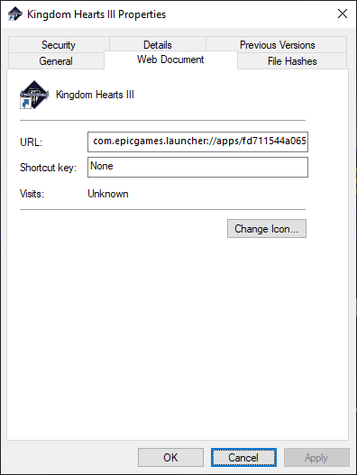

<div align="center">

**A very small .NET Console app to launch Epic Games Store games from a Steam Link**

[](https://github.com/favna/SteamLinkEpicLauncher/blob/main/LICENSE.md)
[](https://github.com/Favna/SteamLinkEpicLauncher/actions/workflows/continuous-deployment.yml)

</div>

---

## About

This is a very simple .NET console app based on [the article from Sean Z](https://seanzwrites.com/posts/how-to-play-epic-games-on-steam-and-steamlink/) on how to launch Epic Store Games on a Steam Link device or mobile app. This is often needed for games in the Epic Game Store because of their DRM.

That said, special thanks to [Sean Z](https://twitter.com/Sean_Z_Writes) for his article.

## Usage

### Download

Download latest stable release from [the GitHub releases page](https://github.com/favna/SteamLinkEpicLauncher/releases/latest)

Alternatively you can also get the latest build from [GitHub Actions artifacts](https://github.com/Favna/SteamLinkEpicLauncher/actions/workflows/continuous-deployment.yml/badge.svg?branch=main)

### Adding an Epic Store game to Steam

**_Setting up the SteamLinkEpicLauncher_**

1. Download the SteamLinkEpicLauncher as linked above
2. Extract the zip to a folder where you can be sure the executable will always be available.
    - I personally recommend creating some dedicated folder for it somewhere. For example, do not place it in your "Downloads" folder, just in case you accidentally delete it from there.

**_Getting the URL of the Epic game_**

1. Open Epic Games Store.
2. Navigate to your library.
3. Find the game you want in Steam.
4. Click the `. . .` menu near the game.
5. Click "Create Shortcut". This will place a shortcut on your desktop.
6. Minimize the launcher, navigate to your Desktop, and find your new shortcut (it will have the name and icon of the game).
7. Right click on the shortcut and hit "Properties".
8. A window similar to this should show up:

.

9. Copy the value in the URL field and save it somewhere for later.

**_Adding your game to steam_**

1. Open Steam
2. Click "Add a game" then "Add a Non-Steam Game"
3. Click "Browse" and navigate to the `SteamLinkEpicLauncher.exe`, select it, then confirm adding the game with "Add selected programs"
4. Right click the newly added "SteamLinkEpicLauncher" and click "Properties"
5. In the "Target" field add a single `space` and a single `"` (quote) character. Then paste the value you copied in the previous section, and type another `"` (quote) character.
    - For example for Kingdom Hearts 3 the full "Target" could be:
    ```
    "E:\dev\favna\SteamLinkEpicLauncher\out\SteamLinkEpicLauncher.exe" "com.epicgames.launcher://apps/fd711544a06543e0ab1b0808de334120?action=launch&silent=true"
    ```
6. Customize the name of your shortcut by modifying "SteamLinkEpicLauncher" to whatever you want
7. Click the generic icon to change it to something you want.
    - Tip: you can navigate to the executable of your game to assign the icon of that executable.

**_Launching your game_**

1. Make sure the Epic Games Store is running on your system
2. Start your Steam Link
3. Launch the game shortcut you created

## Buy me some doughnuts

This project is and always will be open source, even if I don't get donations. That being said, I know there are amazing people who may still want to donate just to show their appreciation. Thank you very much in advance!

I accept donations through Ko-fi, Paypal, Patreon, GitHub Sponsorships, and various crypto currencies. You can use the buttons below to donate through your method of choice.

|   Donate With   |                      Address                      |
| :-------------: | :-----------------------------------------------: |
|      Ko-fi      |  [Click Here](https://donate.favware.tech/kofi)   |
|     Patreon     | [Click Here](https://donate.favware.tech/patreon) |
|     PayPal      | [Click Here](https://donate.favware.tech/paypal)  |
| GitHub Sponsors |  [Click Here](https://github.com/sponsors/Favna)  |
|     Bitcoin     |       `1E643TNif2MTh75rugepmXuq35Tck4TnE5`        |
|    Ethereum     |   `0xF653F666903cd8739030D2721bF01095896F5D6E`    |
|    LiteCoin     |       `LZHvBkaJqKJRa8N7Dyu41Jd1PDBAofCik6`        |
